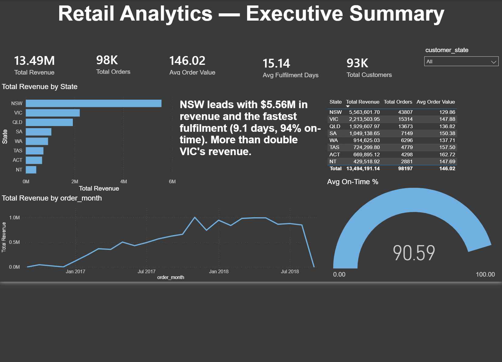
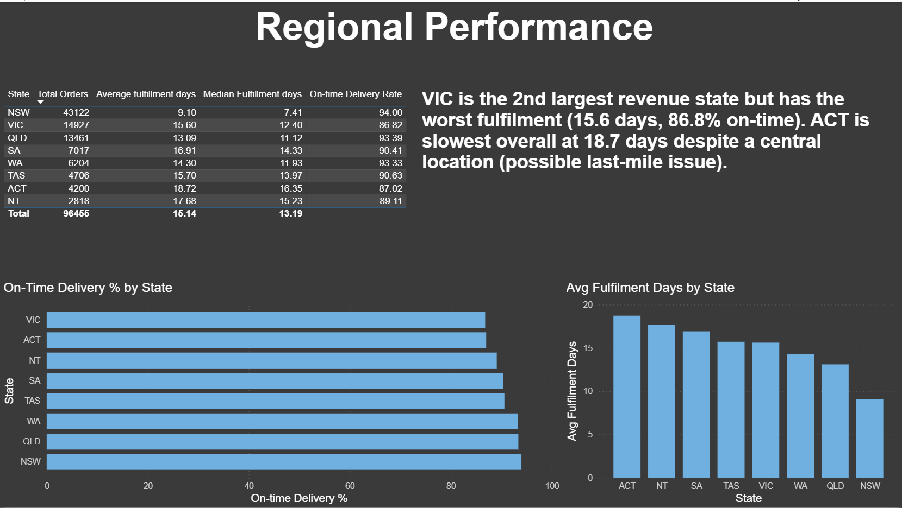
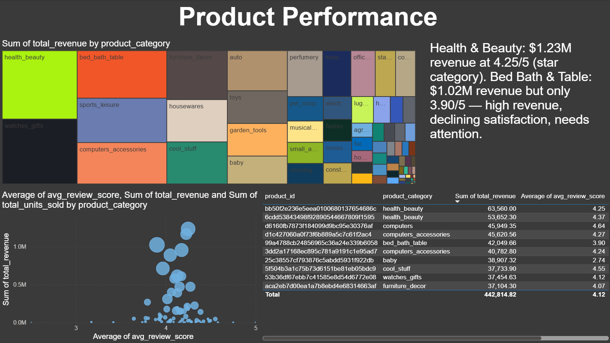
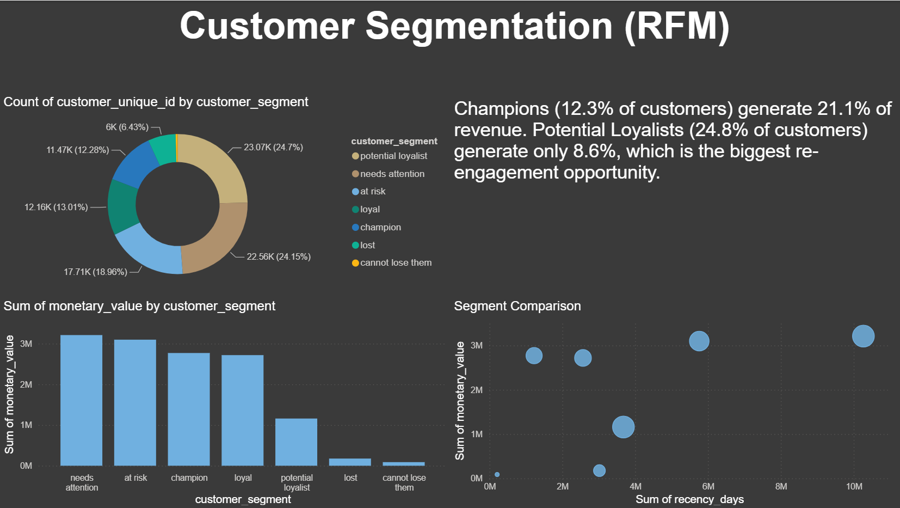
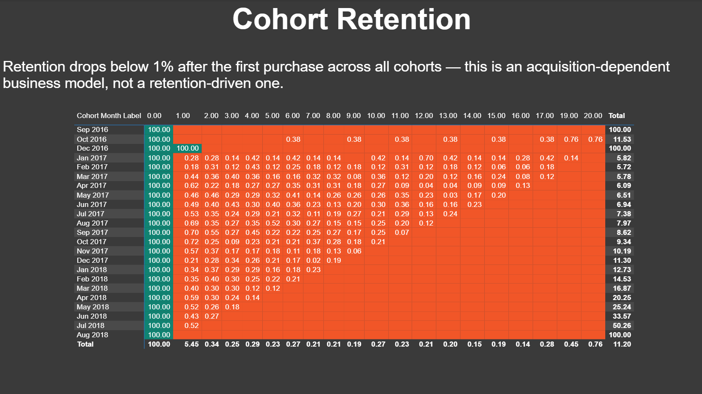

# Retail Sales Analytics Pipeline
# End-to-End SQL Project | Medallion Architecture | PostgreSQL
# Project Overview

This project is a production-style retail analytics pipeline built using PostgreSQL and a Medallion Architecture (Bronze → Silver → Gold).

It processes ~1.6 million rows of e-commerce transaction data across 9 related tables, cleans and transforms the data, and builds 5 business-ready Gold tables used for analysis and reporting.

The goal of this project is to demonstrate real-world data analyst skills using SQL — including data modeling, window functions, cohort analysis, and customer segmentation.

Business Questions Answered
#	Business Question	Gold Table Used
1	Which months and states generate the most revenue and how is it trending?	sales_summary_monthly
2	Which products and categories drive the most revenue?	product_performance
3	Who are our high-value customers and what does each segment look like?	customer_rfm
4	Which states show declining revenue and need attention?	sales_summary_monthly
5	What is the average basket size and how does it vary by state?	sales_summary_monthly
6	How well do we retain customers after their first purchase?	cohort_retention
7	Where are delays happening in the fulfilment process?	fulfilment_metrics
8	Which products have high revenue but low customer satisfaction?	product_performance
Data Architecture
Raw CSV Files
      ↓
BRONZE LAYER  
- Raw ingestion (all columns as VARCHAR)  
- 9 tables (direct copy of source data)  
- ~1.6M rows  

      ↓
SILVER LAYER  
- Cleaned and standardized data  
- Proper data types applied  
- Null handling and transformations  
- Geographic normalization (AU states)  
- 7 transformed tables  

      ↓
GOLD LAYER  
- Business-ready aggregated tables  
- Built specifically for analysis  
- 5 final analytical tables  
Key Insights
Revenue & Sales
November 2017 was the highest revenue month at $1,003,862, driven by Black Friday sales
Average order value increased by 14% from Jan to Apr 2018
NSW is the top-performing state with $5.56M revenue and fastest fulfilment time
Customer Segmentation (RFM)
Champions (12.3%) generate 21.1% of total revenue
Potential Loyalists (24.8%) contribute only 8.6% of revenue → biggest growth opportunity
Cohort retention drops below 1% after first purchase → strong acquisition dependency
Product Performance
Health & Beauty leads revenue with $1.23M and strong satisfaction (4.25 rating)
Bed, Bath & Table shows a risk pattern: high revenue but lower satisfaction (3.90 rating)
Computers have the highest average order value at $1,367 per order
Fulfilment & Operations
VIC has the lowest on-time delivery rate (86.82%) despite high volume
ACT has the slowest fulfilment time (18.72 days average)
NSW performs best overall with 94% on-time delivery and 9.1 days average fulfilment
Tech Stack
Database: PostgreSQL 15+
Query Tool: DBeaver
Visualization: Power BI
Dataset: Olist Brazilian E-Commerce (Kaggle)
Version Control: Git / GitHub
Repository Structure
retail-sql-analytics/
│
├── README.md
│
├── data/
│   └── README.md (dataset instructions)
│
├── sql/
│   ├── 00_setup/
│   ├── 01_bronze/
│   ├── 02_silver/
│   ├── 03_gold/
│   └── 04_analysis/
│
└── docs/
    └── data_dictionary.md
How to Run This Project
Install PostgreSQL and DBeaver
Download the Olist dataset from Kaggle (see /data/README.md)
Run scripts in order:
00_setup/create_schemas.sql
01_bronze/create_bronze_tables.sql
Import CSVs via DBeaver
02_silver/create_silver_tables.sql
Run all scripts in 03_gold/
Optional: 04_analysis/business_questions.sql
SQL Skills Demonstrated
Concept	Where Used
Joins (INNER, LEFT)	All Gold tables
CTEs (multi-level)	All transformations
Window Functions (RANK, LAG, NTILE)	Cohort, RFM, trends
Aggregations	All Gold tables
Date Functions	Orders, cohorts, fulfilment
CASE WHEN logic	Silver + Gold layers
NULL handling (COALESCE, NULLIF)	Silver layer
Percentile calculations	Fulfilment analysis
Regex filtering	Review cleaning
Type casting	Entire Silver layer
Power BI Dashboard

An interactive 5-page Power BI dashboard built on top of the Gold layer tables. It turns the SQL outputs into business insights and visual storytelling.

Dashboard Pages
Executive Overview — KPIs, revenue trends, top-level insights
Regional Performance — state-level sales and fulfilment analysis
Product Performance — revenue vs customer satisfaction analysis
Customer Segmentation (RFM) — customer groups and revenue contribution
Cohort Retention — customer retention heatmap over time
Screenshots

The .pbix file is available in the Powerbi/ folder. Connect it to your PostgreSQL database with the Gold tables loaded to explore the dashboard interactively.